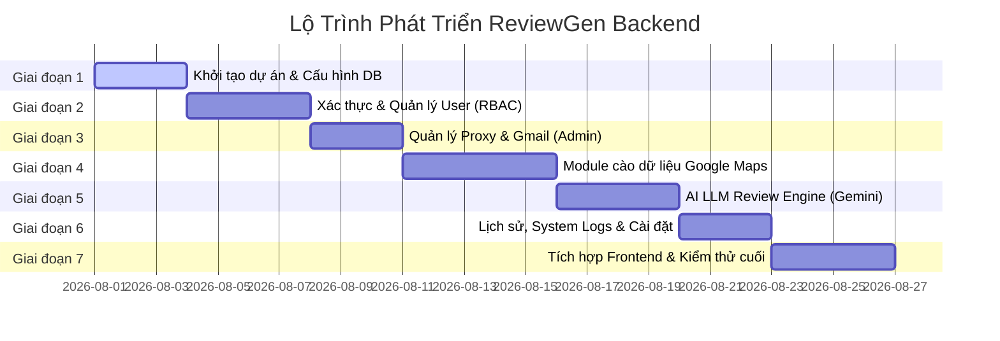

# LỘ TRÌNH PHÁT TRIỂN HỆ THỐNG BACKEND (BACKEND DEVELOPMENT ROADMAP)

Dự án: **ReviewGen Backend (FastAPI + PostgreSQL + Gemini AI)**  
Tài liệu định nghĩa các giai đoạn phát triển, chức năng chi tiết và phương pháp thực hiện cụ thể.

---

## TỔNG QUAN CÁC GIAI ĐOẠN (ROADMAP OVERVIEW)



---

## CHI TIẾT TỪNG GIAI ĐOẠN

### GIAI ĐOẠN 1: KHỞI TẠO DỰ ÁN & THIẾT LẬP CƠ SỞ DỮ LIỆU (POSTGRESQL)
*   **Mục tiêu:** Xây dựng khung xương dự án chuẩn, kết nối thành công PostgreSQL và chuẩn bị migration.
*   **Nhiệm vụ cụ thể:**
    1.  Tạo toàn bộ cấu trúc thư mục của `app/` và các file `__init__.py` tương ứng trong từng folder con để đóng gói module.
    2.  Cấu hình `app/main.py` đăng ký CORS, Middlewares và Exception Handlers toàn cục.
    3.  Tạo file `app/config.py` sử dụng `pydantic-settings` để đọc cấu hình từ file `.env` (DB URL, JWT Secret, Gemini API Key).
    4.  Cấu hình SQLAlchemy kết nối bất đồng bộ (`AsyncSession` + `asyncpg`).
    5.  Khởi tạo **Alembic** để quản lý migration. Định nghĩa các DB Models (`users`, `gmail_accounts`, `proxies`, `businesses`, `review_history`, `system_logs`) trong thư mục `app/models/`.
    6.  Chạy lệnh migration đầu tiên để tạo các bảng dữ liệu trên PostgreSQL.
*   **Cách thực hiện (How-to):**
    *   Tạo session helper trong `app/database.py` cung cấp kết nối DB thông qua Dependency injection `Depends`.
    *   Chạy các lệnh khởi tạo Alembic:
        ```bash
        alembic init alembic
        # Cấu hình alembic.ini trỏ đến DB
        alembic revision --autogenerate -m "initial_schema"
        alembic upgrade head
        ```

---

### GIAI ĐOẠN 2: XÁC THỰC (AUTH) & QUẢN LÝ TÀI KHOẢN NGƯỜI DÙNG
*   **Mục tiêu:** Cung cấp tính năng đăng nhập bảo mật và quản trị người dùng cho Admin.
*   **Nhiệm vụ cụ thể:**
    1.  Viết helper mã hóa mật khẩu sử dụng `bcrypt` (Salt factor = 10) trong `app/services/auth.py`.
    2.  Xây dựng dịch vụ tạo và xác thực **JWT Access Token** (thời hạn 24 giờ).
    3.  Viết Authentication Middleware / Dependency kiểm tra JWT token hợp lệ và phân quyền người dùng (Role Guard: `admin` hoặc `user`).
    4.  Viết API `POST /api/v1/auth/login` (Xác thực thông tin đăng nhập, kiểm tra trạng thái tài khoản `is_active`).
    5.  Xây dựng bộ API quản trị người dùng dành riêng cho Admin (`/api/v1/admin/users`): Lấy danh sách, tạo tài khoản mới, cập nhật thông tin/quyền hạn, đổi trạng thái hoạt động (khóa/mở khóa) và reset mật khẩu về mặc định.
*   **Cách thực hiện (How-to):**
    *   Sử dụng thư viện `PyJWT[crypto]` để ký và giải mã JWT token.
    *   Sử dụng cơ chế `Security(get_current_user, scopes=["admin"])` của FastAPI để giới hạn các API Admin.

---

### GIAI ĐOẠN 3: QUẢN LÝ PROXY & TÀI KHOẢN GMAIL (ADMIN ONLY)
*   **Mục tiêu:** Cho phép Admin lưu trữ và quản lý danh sách tài nguyên phục vụ tác vụ cào dữ liệu và chạy tool đăng bài tự động.
*   **Nhiệm vụ cụ thể:**
    1.  Xây dựng bộ API CRUD cho tài khoản Gmail (`/api/v1/admin/gmails`): Cho phép thêm mới Gmail (kèm mật khẩu), sửa trạng thái (`Hoạt động`, `Bị khóa`, `Cần xác minh`), và xóa tài khoản.
    2.  Xây dựng bộ API CRUD cho danh sách Proxies (`/api/v1/admin/proxies`): Lưu trữ IP, Port, Username, Password và trạng thái (`Hoạt động`, `Không hoạt động`).
*   **Cách thực hiện (How-to):**
    *   Mật khẩu Gmail nên được mã hóa đối xứng (Sử dụng thư viện `cryptography.fernet`) trước khi lưu xuống PostgreSQL để đảm bảo an toàn dữ liệu nhưng vẫn lấy lại được mật khẩu gốc khi chạy tool tự động.

---

### GIAI ĐOẠN 4: MODULE CÀO DỮ LIỆU GOOGLE MAPS (BACKEND SCRAPER)
*   **Mục tiêu:** Tự động thu thập thông tin và phân tích ngữ cảnh doanh nghiệp từ một liên kết Google Maps gửi lên.
*   **Nhiệm vụ cụ thể:**
    1.  Định nghĩa interface `BaseScraper` trong `app/interface/scraper.py` định nghĩa đầu vào/đầu ra.
    2.  Viết service cào dữ liệu `PlaywrightScraper` trong `app/services/scraper.py` kế thừa từ interface trên.
    3.  Tích hợp cơ chế lấy ngẫu nhiên 1 Proxy hoạt động từ Database để chạy trình duyệt ẩn danh Playwright, truy cập liên kết Maps doanh nghiệp.
    4.  Cào các thông tin: Tên doanh nghiệp, Lĩnh vực hoạt động, Địa chỉ, Điểm đánh giá, Tổng số đánh giá, và mẫu các review gần nhất.
    5.  Xử lý tách lọc từ khóa chính (Extracted Keywords) bằng BeautifulSoup4 từ dữ liệu HTML cào về.
    6.  Xây dựng API `POST /api/v1/business/parse` nhận URL Maps, cào thông tin, lưu trữ vào bảng `businesses` (nếu chưa có hoặc quá hạn cache 24h) và trả dữ liệu JSON cho Frontend.
*   **Cách thực hiện (How-to):**
    *   Cài đặt môi trường Playwright trên server:
        ```bash
        playwright install chromium --with-deps
        ```
    *   Khởi chạy Playwright ở chế độ headless ngầm và mô phỏng User-Agent thật để vượt bộ lọc bot của Google.

---

### GIAI ĐOẠN 5: AI REVIEW ENGINE (GOOGLE GEMINI INTEGRATION)
*   **Mục tiêu:** Sinh các mẫu câu review tự nhiên, đúng ngữ cảnh doanh nghiệp theo tùy chọn của người dùng.
*   **Nhiệm vụ cụ thể:**
    1.  Định nghĩa interface `BaseLLMClient` trong `app/interface/llm.py`.
    2.  Viết client tích hợp `GeminiClient` trong `app/AI/gemini.py` sử dụng thư viện `google-genai` chính thức.
    3.  Thiết kế hệ thống Prompt mẫu (Prompt Templates) cho AI tùy biến theo: Tone giọng (Nhiệt tình, Khách quan, Ngắn gọn...), Ngôn ngữ (Tiếng Việt, Tiếng Anh...), Độ dài bài viết, Điểm số sao mong muốn (1-5 sao) và Từ khóa tập trung (Focus Keywords).
    4.  Xây dựng API `POST /api/v1/reviews/generate` nhận thông tin doanh nghiệp cùng tùy chọn sinh review, gọi Gemini API sinh nội dung, lưu lịch sử vào bảng `review_history` và trả về danh sách các câu review cho Frontend.
*   **Cách thực hiện (How-to):**
    *   Sử dụng tính năng **Structured Outputs** (Pydantic Schema) của Gemini API để định dạng kết quả trả về luôn là một danh sách JSON hợp lệ có cấu trúc chặt chẽ.

---

### GIAI ĐOẠN 6: LỊCH SỬ, LOGS HỆ THỐNG & CẤU HÌNH AI
*   **Mục tiêu:** Hoàn thiện các chức năng bổ trợ bao gồm lưu trữ lịch sử, theo dõi nhật ký hoạt động hệ thống và cấu hình tham số AI.
*   **Nhiệm vụ cụ thể:**
    1.  Xây dựng API lịch sử review (`/api/v1/history`): Cho phép người dùng lấy danh sách các lần sinh review trước đó, xuất dữ liệu dạng CSV/TXT và xóa lịch sử.
    2.  Xây dựng API cài đặt hệ thống (`/api/v1/settings`): Lưu trữ cấu hình AI Key mặc định, Model ID mặc định và System Prompt cấu hình cốt lõi.
    3.  Xây dựng hệ thống Log Service ghi nhận lỗi hệ thống, hoạt động đăng nhập và tác vụ cào dữ liệu lưu vào bảng `system_logs`. Cung cấp API `GET /api/v1/admin/logs` cho Admin theo dõi.
*   **Cách thực hiện (How-to):**
    *   Sử dụng thư viện chuẩn `logging` của Python kết hợp một Custom Handler để đẩy các log nghiêm trọng (`WARNING`, `ERROR`) vào PostgreSQL song song với file log vật lý.

---

### GIAI ĐOẠN 7: TÍCH HỢP HỆ THỐNG & NGHIỆM THU (E2E TESTING)
*   **Mục tiêu:** Đấu nối Frontend React Router với các API thực tế của Backend và chạy thử nghiệm toàn bộ hệ thống.
*   **Nhiệm vụ cụ thể:**
    1.  Thay thế toàn bộ mock client trong file `app/lib/api-client.ts` ở Frontend thành các request thực tế gọi lên FastAPI Backend sử dụng thư viện `axios` (hoặc `fetch`).
    2.  Thiết lập interceptor ở Frontend tự động đính kèm JWT Token vào Header của các request (`Authorization: Bearer <token>`).
    3.  Kiểm thử luồng đi hoàn chỉnh (E2E): Admin tạo tài khoản -> Đăng nhập -> Cấu hình URL Maps -> Cào dữ liệu -> AI sinh review -> Xem lịch sử/Nhật ký -> Thay đổi cấu hình.
