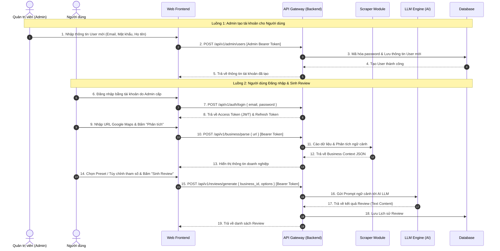

# ĐẶC TẢ KIẾN TRÚC HỆ THỐNG VÀ API (SYSTEM ARCHITECTURE & API DESIGN)

**Dự án**: Tool Sinh Review Đánh Giá Doanh Nghiệp Google Maps (Google Maps Review Generator)  
**Phiên bản**: 0.0.4  
**Tác giả**: Antigravity AI  

---

## 1. TỔNG QUAN KIẾN TRÚC HỆ THỐNG (HIGH-LEVEL ARCHITECTURE)

Hệ thống được thiết kế theo mô hình **Client-Server Architecture** phân tách rõ ràng giữa Frontend (UI) và Backend (RESTful APIs), đi kèm các Worker xử lý cào dữ liệu và kết nối LLM Engine.

```
┌─────────────────────────────────────────────────────────┐
│                      Client Layer                       │
│           (Web Frontend - HTML/JS/Vite/React)           │
└────────────────────────────┬────────────────────────────┘
                             │ REST API (JSON + Bearer JWT)
                             ▼
┌─────────────────────────────────────────────────────────┐
│                    API Gateway / Router                 │
│         - Auth Middleware (JWT & Role Guard)            │
└───────┬────────────────────┬────────────────────┬───────┘
        │                    │                    │
        ▼                    ▼                    ▼
┌──────────────┐     ┌──────────────┐     ┌──────────────┐
│   Scraper    │     │  Business    │     │  LLM Review  │
│   Module     │ ──► │   Analyzer   │ ──► │    Engine    │
│(Playwright/  │     │   Module     │     │(OpenAI/      │
│ Puppeteer/   │     │ (Context     │     │ Gemini API)  │
│ Axios/Proxy) │     │  Builder)    │     │              │
└──────────────┘     └──────────────┘     └──────────────┘
                                                  │
                             ┌────────────────────┘
                             ▼
┌─────────────────────────────────────────────────────────┐
│                     Database Layer                      │
│                      (PostgreSQL)                       │
│   - Users & Roles   - Presets   - History   - Cache     │
└─────────────────────────────────────────────────────────┘
```

---

## 2. LUỒNG XỬ LÝ DỮ LIỆU CHÍNH (SEQUENCE DIAGRAM)



---

## 3. DANH SÁCH BẢNG DỮ LIỆU (DATABASE SCHEMAS / MODELS)

### 3.1 Bảng `users` (Quản lý tài khoản)

| Tên trường | Kiểu dữ liệu | Mô tả |
| --- | --- | --- |
| `id` | String / ObjectId | Khóa chính (Primary Key) |
| `email` | String | Email đăng nhập (Unique, Indexed) |
| `password_hash` | String | Mật khẩu mã hóa bằng Bcrypt/Argon2 |
| `full_name` | String | Họ và tên người dùng |
| `role` | String | Vai trò tài khoản (`user`, `admin`) |
| `is_active` | Boolean | Trạng thái hoạt động (`true`: Active, `false`: Blocked) |
| `created_by` | String / ObjectId | ID của Admin đã tạo tài khoản này |
| `created_at` | DateTime | Thời điểm Admin tạo tài khoản |
| `updated_at` | DateTime | Thời điểm cập nhật gần nhất |

---

### 3.2 Bảng `preset_templates` (Lưu mẫu cấu hình sinh review)

| Tên trường | Kiểu dữ liệu | Mô tả |
| --- | --- | --- |
| `id` | String / ObjectId | Khóa chính |
| `user_id` | String / ObjectId | Khóa ngoại tham chiếu `users` |
| `template_name` | String | Tên mẫu cấu hình |
| `tone` | String | Tông giọng mặc định |
| `language` | String | Ngôn ngữ mặc định (`vi`, `en`,...) |
| `length` | String | Độ dài mặc định (`short`, `medium`, `long`) |
| `focus_keywords` | Array<String> | Danh sách từ khóa mẫu |
| `created_at` | DateTime | Thời điểm tạo mẫu |

---

### 3.3 Bảng `businesses` (Lưu thông tin & Cache doanh nghiệp)

| Tên trường | Kiểu dữ liệu | Mô tả |
| --- | --- | --- |
| `id` | String / ObjectId | Khóa chính (Primary Key) |
| `place_id` | String | Mã nhận diện địa điểm trên Google Maps |
| `url` | String | URL Google Maps thô |
| `name` | String | Tên doanh nghiệp |
| `category` | String | Ngành nghề / Danh mục chính |
| `address` | String | Địa chỉ chi tiết |
| `rating_score` | Float | Điểm đánh giá trung bình |
| `review_count` | Integer | Tổng số lượt đánh giá hiện có |
| `extracted_keywords` | Array<String> | Danh sách từ khóa trích xuất được |
| `raw_reviews_sample` | Array<String> | Mẫu review hiện tại |
| `created_at` | DateTime | Thời điểm thu thập dữ liệu |

---

### 3.4 Bảng `review_histories` (Lưu lịch sử sinh Review)

| Tên trường | Kiểu dữ liệu | Mô tả |
| --- | --- | --- |
| `id` | String / ObjectId | Khóa chính |
| `user_id` | String / ObjectId | Khóa ngoại tham chiếu `users` |
| `business_id` | String / ObjectId | Khóa ngoại tham chiếu `businesses` |
| `tone` | String | Tông giọng được chọn |
| `language` | String | Ngôn ngữ được chọn |
| `length` | String | Độ dài được chọn |
| `custom_keywords` | Array<String> | Từ khóa bổ sung |
| `generated_reviews` | Array<Object> | Danh sách câu review đã sinh |
| `created_at` | DateTime | Thời điểm sinh review |

---

## 4. CHI TIẾT CÁC ENDPOINT API (RESTFUL API SPECIFICATION)

### 4.1 `POST /api/v1/auth/login`
- **Mục đích**: Đăng nhập hệ thống bằng tài khoản do Admin cấp.
- **Request Body**:
  ```json
  {
    "email": "user@example.com",
    "password": "Password123!"
  }
  ```
- **Response 200 OK**:
  ```json
  {
    "status_code": 200,
    "success": true,
    "message": "Đăng nhập thành công.",
    "data": {
      "access_token": "eyJhbGciOiJIUzI1NiIsInR5cCI6IkpXVCJ9...",
      "refresh_token": "def4567890...",
      "token_type": "Bearer",
      "expires_in": 86400,
      "user": {
        "id": "usr_123456",
        "email": "user@example.com",
        "full_name": "Nguyễn Văn A",
        "role": "user"
      }
    }
  }
  ```

---

### 4.2 `POST /api/v1/auth/refresh`
- **Mục đích**: Cấp Access Token mới bằng Refresh Token khi Access Token bị hết hạn.
- **Request Body**:
  ```json
  {
    "refresh_token": "def4567890..."
  }
  ```
- **Response 200 OK**:
  ```json
  {
    "status_code": 200,
    "success": true,
    "data": {
      "access_token": "new_eyJhbGciOiJIUzI1Ni...",
      "expires_in": 86400
    }
  }
  ```

---

### 4.3 `POST /api/v1/auth/logout`
- **Mục đích**: Đăng xuất tài khoản và thu hồi Refresh Token.
- **Headers Required**: `Authorization: Bearer <access_token>`
- **Response 200 OK**:
  ```json
  {
    "status_code": 200,
    "success": true,
    "message": "Đăng xuất thành công."
  }
  ```

---

### 4.4 `POST /api/v1/admin/users` (Admin - Tạo tài khoản mới)
- **Mục đích**: Quản trị viên (Admin) tạo tài khoản mới cho người dùng.
- **Headers Required**: `Authorization: Bearer <admin_access_token>`
- **Request Body**:
  ```json
  {
    "email": "newuser@example.com",
    "password": "InitialPassword123!",
    "full_name": "Trần Văn B",
    "role": "user"
  }
  ```
- **Response 201 Created**:
  ```json
  {
    "status_code": 201,
    "success": true,
    "message": "Tạo tài khoản người dùng thành công.",
    "data": {
      "id": "usr_998877",
      "email": "newuser@example.com",
      "full_name": "Trần Văn B",
      "role": "user",
      "is_active": true
    }
  }
  ```

---

### 4.5 `GET /api/v1/admin/users` (Admin - Xem danh sách người dùng)
- **Mục đích**: Admin xem danh sách tất cả tài khoản người dùng trong hệ thống.
- **Headers Required**: `Authorization: Bearer <admin_access_token>`
- **Response 200 OK**:
  ```json
  {
    "status_code": 200,
    "success": true,
    "data": [
      {
        "id": "usr_998877",
        "email": "newuser@example.com",
        "full_name": "Trần Văn B",
        "role": "user",
        "is_active": true,
        "created_at": "2026-07-27T11:50:00Z"
      }
    ]
  }
  ```

---

### 4.6 `PUT /api/v1/admin/users/:user_id/status` (Admin - Khóa/Mở khóa tài khoản)
- **Mục đích**: Admin bật hoặc vô hiệu hóa trạng thái hoạt động của tài khoản người dùng.
- **Headers Required**: `Authorization: Bearer <admin_access_token>`
- **Request Body**:
  ```json
  {
    "is_active": false
  }
  ```
- **Response 200 OK**:
  ```json
  {
    "status_code": 200,
    "success": true,
    "message": "Cập nhật trạng thái tài khoản thành công."
  }
  ```

---

### 4.7 `POST /api/v1/business/parse`
- **Mục đích**: Nhận URL Google Maps và thu thập dữ liệu địa điểm.
- **Headers Required**: `Authorization: Bearer <access_token>`
- **Request Body**:
  ```json
  {
    "url": "https://www.google.com/maps/place/Quan+An+Ngong+Sài+Gòn/..."
  }
  ```
- **Response 200 OK**:
  ```json
  {
    "status_code": 200,
    "success": true,
    "data": {
      "business_id": "biz_65a123f890",
      "place_id": "ChIJN1tL-38zdTER...",
      "name": "Nhà hàng Ẩm thực Việt",
      "category": "Nhà hàng Ẩm thực Nam Bộ",
      "address": "123 Đường Nguyễn Trãi, Quận 1, TP. Hồ Chí Minh",
      "rating_score": 4.7,
      "review_count": 350,
      "extracted_keywords": [
        "món ăn ngon",
        "phục vụ chu đáo"
      ],
      "cached": false
    }
  }
  ```

---

### 4.8 `POST /api/v1/reviews/generate`
- **Mục đích**: Sinh danh sách câu review từ AI LLM.
- **Headers Required**: `Authorization: Bearer <access_token>`
- **Request Body**:
  ```json
  {
    "business_id": "biz_65a123f890",
    "quantity": 5,
    "options": {
      "tone": "Nhiệt tình",
      "language": "vi",
      "length": "medium",
      "target_rating": 5,
      "focus_keywords": ["lẩu thái chua cay"]
    }
  }
  ```
- **Response 200 OK**:
  ```json
  {
    "status_code": 200,
    "success": true,
    "data": {
      "history_id": "hist_998877",
      "business_name": "Nhà hàng Ẩm thực Việt",
      "reviews": [
        {
          "id": 1,
          "rating": 5,
          "content": "Quá ấn tượng với món lẩu thái chua cay ở đây! Đồ ăn tươi ngon đậm đà, nhân viên dễ thương nhiệt tình hỗ trợ."
        }
      ]
    }
  }
  ```

---

### 4.9 `GET /api/v1/presets` & `POST /api/v1/presets`
- **Mục đích**: Quản lý mẫu cấu hình sinh review (Preset Templates) của cá nhân.
- **Headers Required**: `Authorization: Bearer <access_token>`

---

### 4.10 `GET /api/v1/history` & Export
- **Mục đích**: Lấy danh sách lịch sử sinh review hoặc xuất file TXT/CSV.
- **Headers Required**: `Authorization: Bearer <access_token>`
